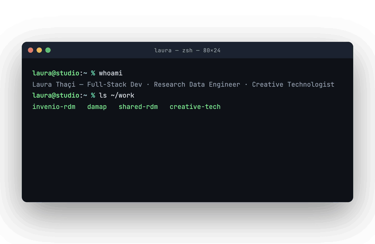

  <picture>
    <source media="(prefers-color-scheme: dark)" srcset="./terminal-dark.gif">
    
  </picture>

I'm a **Full-Stack Software Engineer** based in Graz, Austria.
I build and operate the research data infrastructure that Austrian universities
rely on full-stack, end to end— and I contribute to the open-source tools
behind open science. I also work where **code meets art**.

---

####  Open Source & Open Science

**[DAMAP](https://github.com/damap-org)**  core contributor; machine-actionable data management planning tool. 
**[SharedRDM](https://github.com/sharedRDM)** multi-institution Austrian RDM infrastructure. Led the shared institutional template and multi-instance deployments. 
**[InvenioRDM · CERN](https://github.com/inveniosoftware)** member of the InvenioSoftware org. 
**[Fair Data Austria](https://github.com/fair-data-austria)** · **OSTrails (EU)** machine-actionable DMP tooling and FAIR assessment; co-author of deliverable D1.1. 
**Bio+Med+Vis Summer School** (2025, *TU Delft*) scholarship recipient; biomedical data visualization.

####  Creative Technology

**Navigating Estrangement** (2026) two autonomous, synchronised robotic tables with choreographed motion, built with ROS2. Contributed software development and robotics programming. Manor Art Prize, Kunsthaus Biel.   
**Ars Electronica Festival** (2021 & 2022) wearable interfaces of movement, sound, and light. 
**H.E.I.K.E** (2018) a drawing machine that converts facial expressions into line art via microcontroller. *Creator ≠ Created, Smallest Gallery, Graz.*

####  Experience

**Graz University of Technology** Full-Stack Software Engineer, Research Data Management; building and operating research data infrastructure across Austrian universities. 
**Graz University of Technology · ISEC** Frontend Developer (part-time) on a ministry-funded React platform for online teaching. TypeScript & React. 
**ProTechnology** *(Dresden)* software development with TypeScript, React, progressive web apps, and cloud technologies. 
**AVL** full-stack web development internship; introduction to enterprise-scale engineering and agile workflows.

---

####  Languages & Technologies

---
